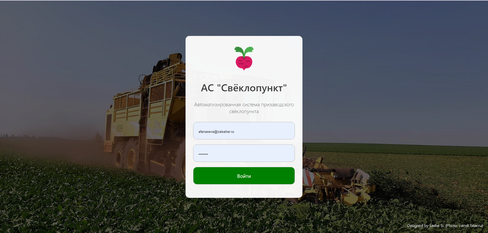
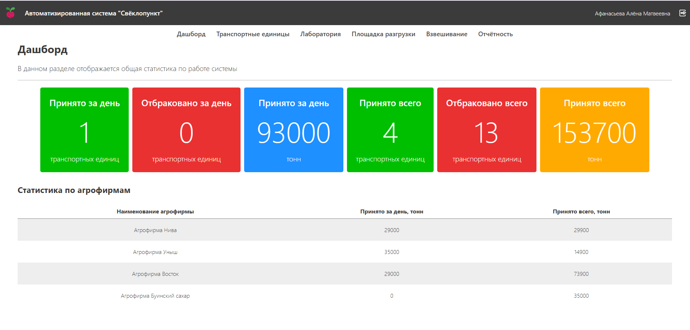
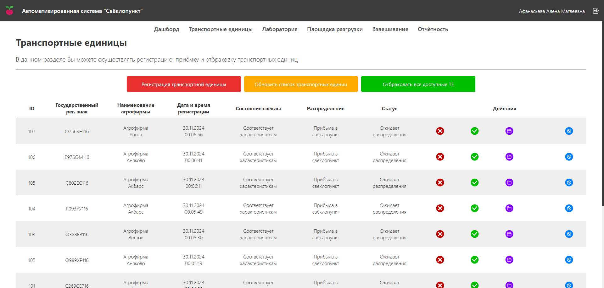
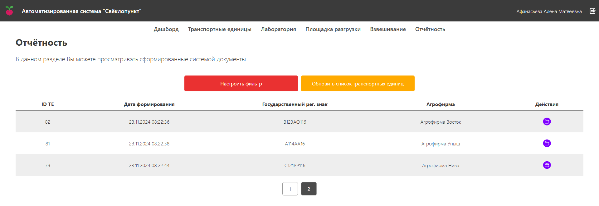
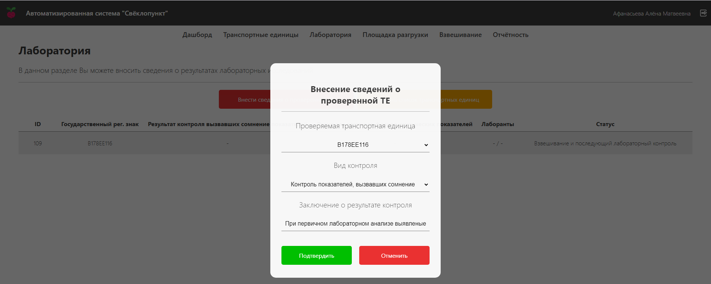
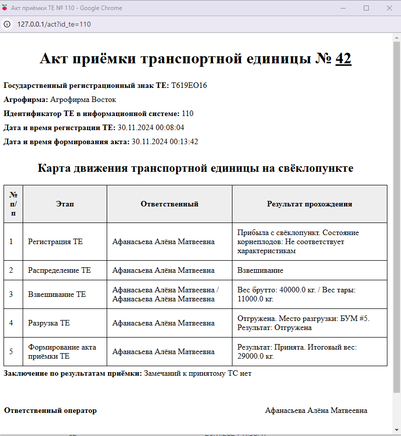
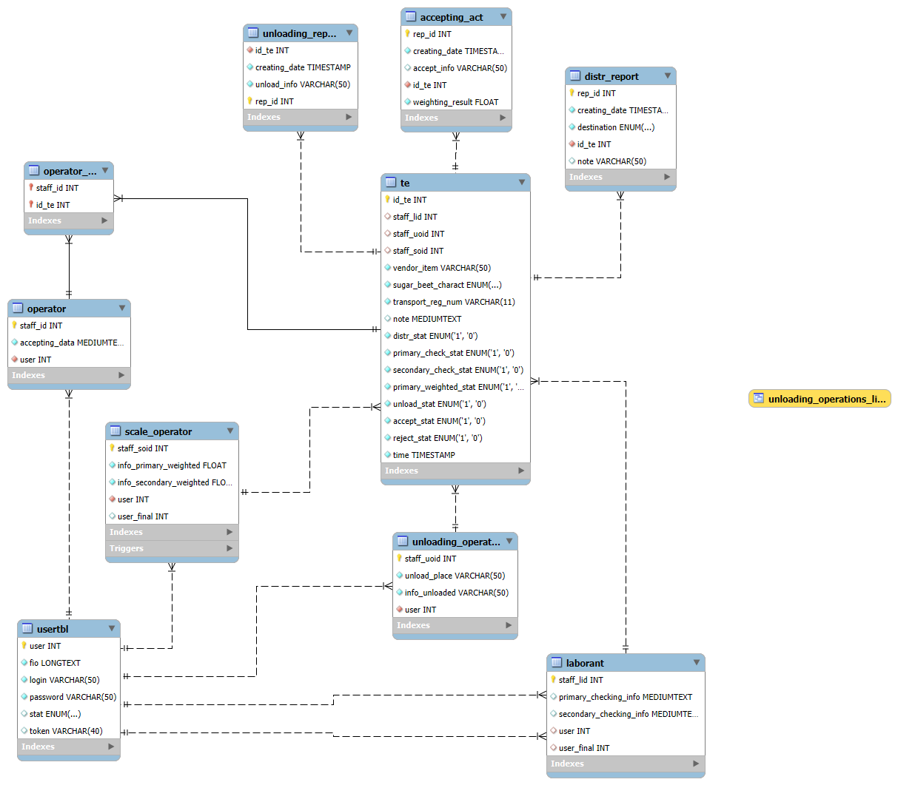

# Автоматизированная система "Свёклопункт"

---

Информационная система в составе АС "Свёклопункт" предназначена для хранения и обработки информации о транспортных единицах (ТЕ) на призаводском свёклопункте.

Реализован следующий функционал:

+ Регистрация, распределение ТЕ;
+ Отбраковка, принятие ТЕ;
+ Внесение сведений о лабораторных исследованиях ТЕ;
+ Внесение результатов взвешивания ТЕ;
+ Внесение сведений о разгрузке ТЕ;
+ Формирование акта приёмки для ТЕ;
+ Дашборд с аналитикой

Система построена на основании описания технологического процесса приёмки сахарной свёклы.
Особенностью реализации является отсутствие использования ORM-библиотек.

### ER-диаграмма базы данных АС "Свёклопункт"

